# Arsitektur Sistem Menyeluruh: MiroFish v3.1 Enterprise

Dokumen ini menguraikan arsitektur sistem menyeluruh MiroFish, menyandingkan arsitektur eksisting berbasis purwarupa (v2.x) dengan target arsitektur enterprise v3.1, merinci topologi multi-lapisan (*multi-tiered topology*), diagram alur end-to-end, dan mekanisme pemartisian data (*data partitioning*).

---

## 1. Analisis Lapisan Sistem: Eksisting (v2.x) vs Target Enterprise (v3.1)

Sistem MiroFish dirancang menggunakan arsitektur modular berlapis. Tabel di bawah ini merinci evolusi teknis antar lapisan:

```
+-----------------------------------------------------------------------------------+
|                            LAPISAN PRESENTASI (UI/UX)                             |
|  Vue 3 + Vite + TailwindCSS + Element Plus + vue-i18n (ID / ZH / EN) + Canvas Vis |
+-----------------------------------------------------------------------------------+
                                         │ REST API / SSE / MCP
                                         ▼
+-----------------------------------------------------------------------------------+
|                        LAPISAN ORKESTRASI & API GATEWAY                           |
|  Flask Application Factory + Blueprint Modular (Graph, Sim, Report, Research, MCP)|
+-----------------------------------------------------------------------------------+
        │                                 │                                 │
        ▼                                 ▼                                 ▼
+───────────────────────+   +───────────────────────────+   +───────────────────────+
|   LAPISAN RISET WEB   |   |   LAPISAN INTELIGENSI     |   |   LAPISAN SIMULASI    |
|       (LANGKAH 0)     |   |     KNOWLEDGE GRAPH       |   |    MULTI-PLATFORM     |
| - SearXNG Self-Hosted |   | - Zep Cloud Standalone    |   | - 7 Platform OASIS    |
| - Anti-Prompt Inj.    |   | - Dynamic Graph Memory    |   | - Cross-Platform Sync |
| - Credibility Scorer  |   | - Fallback Local Neo4j    |   | - Action Worker Pool  |
+───────────────────────+   +───────────────────────────+   +───────────────────────+
        │                                 │                                 │
        └─────────────────────────────────┼─────────────────────────────────┘
                                          │
                                          ▼
+-----------------------------------------------------------------------------------+
|                        LAPISAN ANALISIS & REPORT AGENT                            |
|  ReACT Multi-turn Loop + ZepTools (InsightForge, Panorama, Search, Interview IPC) |
+-----------------------------------------------------------------------------------+
                                          │
                                          ▼
+-----------------------------------------------------------------------------------+
|                   LAPISAN PERSISTENSI & KETAHANAN OPERASIONAL                     |
|  SQLite (WAL) / PostgreSQL + Checkpoint Hashing + Crash Recovery + AES-256-GCM   |
+-----------------------------------------------------------------------------------+
```

### 1.1 Rincian Matriks Komparasi Tiap Lapisan

| Lapisan Sistem | Arsitektur Eksisting (v2.x) | Target Arsitektur MiroFish v3.1 | Dampak Teknis & Skalabilitas |
| :--- | :--- | :--- | :--- |
| **Lapisan Presentasi** | Vue 3 SPA, antarmuka bilingual (ZH/EN), grafik berbasis Vis.js/ECharts dasar. Komunikasi via polling HTTP reguler. | Vue 3 + Vite, integrasi penuh `vue-i18n` dengan Bahasa Indonesia baku (PUEBI), visualisasi graf interaktif lanjutan, dukungan streaming Server-Sent Events (SSE). | Menghilangkan beban overhead polling berulang; menjamin pengalaman pengguna instan dan ramah untuk pasar Indonesia. |
| **Lapisan API & Manajemen Tugas** | Threading in-memory dengan `TaskManager` dan `ProjectManager` berbasis berkas JSON di `uploads/projects/`. | Hybrid Architecture: Endpoint REST terstruktur didukung oleh `SQLAlchemy` (SQLite WAL / PostgreSQL) dengan penguncian siklus hidup graf (`graph_lifecycle_lock`). | Mencegah inkonsistensi status pada restart server; menjamin sifat transaksi ACID untuk pekerjaan durasi panjang. |
| **Lapisan Riset Awal (Langkah 0)** | Tidak ada; sistem bergantung murni pada dokumen teks/PDF yang diunggah pengguna secara manual. | **Langkah 0: Modul Riset Web SearXNG**. Metasearch multi-mesin privat, ekstraksi fakta otomatis, skoring kredibilitas, dan sanitasi injeksi prompt. | Mengeliminasi bias halusinasi LLM; memperkaya graf dengan fakta empiris mutakhir sebelum simulasi berjalan. |
| **Lapisan Graf Pengetahuan (GraphRAG)** | Terikat langsung pada Zep Cloud Graph API (`graph_id`). Episode batch diserahkan langsung tanpa validasi entitas lokal. | Ekosistem GraphRAG ganda: Zep Cloud Batch API dengan paging aman + antarmuka abstraksi adaptor yang siap dialihkan ke Neo4j self-hosted. | Menjamin kedaulatan data sensitif perusahaan; melindungi dari pembatasan kuota eksternal (*vendor lock-in*). |
| **Lapisan Mesin Simulasi** | Skrip OASIS ganda (`run_parallel_simulation.py`) yang hanya mendukung Twitter dan Reddit. Aksi disimpan di berkas `.jsonl`. | **Engine Simulasi 7-Platform Terpadu**: Twitter, X, Reddit, TikTok, Instagram, Facebook, dan Threads dengan formulasi bobot algoritma spesifik per platform. | Mampu mereplikasi dinamika silang platform (*cross-platform cascade*) yang mencerminkan realitas lanskap media sosial modern. |
| **Lapisan Persistensi & Pemulihan** | Log eksekusi dan checkpoint parsial dalam berkas `run_state.json`. Jika proses mati (*killed*), seluruh proses harus diulang. | **Crash Recovery Scanner & Checkpoint Berkelanjutan**: Snapshot memori agen dan antrean aksi per-ronde dengan verifikasi hash SHA-256. | Kemampuan *Zero-Loss Resume*; tugas simulasi yang terhenti akibat crash server dapat dilanjutkan persis dari ronde terakhir. |
| **Lapisan Gateway Model AI** | Client OpenAI sederhana yang membaca `LLM_API_KEY` dan `LLM_BASE_URL` statis dari variabel lingkungan `.env`. | **9Router Gateway**: Intelligent router dengan circuit breaker, automatic exponential retry, dynamic quota load balancing, dan enkripsi rahasia AES-GCM. | Menjamin ketersediaan simulasi 99.9% tanpa terganggu oleh fluktuasi rate limit atau pemadaman salah satu vendor AI. |
| **Lapisan Analitik & Laporan** | `ReportAgent` ReACT 2-ronde refleksi, pemanggilan alat Zep langsung, keluaran laporan Markdown statis. | `ReportAgent` otonom terpandu ontologi dengan multi-turn reflection fleksibel, integrasi wawancara IPC cerdas, dan evaluasi konsistensi temporal. | Menghasilkan laporan analitik prediktif berkualitas tinggi dengan rujukan simpul graf yang dapat diverifikasi secara ilmiah. |

---

## 2. Diagram Alur Sistem End-to-End

Berikut adalah alur komputasi lengkap dari penerimaan materi awal hingga penerbitan laporan akhir dan interaksi eksploratif:

```mermaid
flowchart TD
    subgraph S0["Langkah 0: Ingesti & Riset Faktual"]
        A[Input Benih: Berita / Kebijakan / Topik] --> B{Riset Web Diaktifkan?}
        B -- Ya --> C[SearXNG Private Metasearch]
        C --> D[Pembersihan & Sanitasi Anti-Injeksi]
        D --> E[Ekstraktor Entitas & Penilai Kredibilitas]
        E --> F[Kompilasi Korpus Gabungan Dokumen + Fakta]
        B -- Tidak --> F
    end

    subgraph S1["Langkah 1: Rekayasa Graf Pengetahuan (GraphRAG)"]
        F --> G[Pemotong Teks Adaptif / Chunking]
        G --> H[LLM Ontology Generator: Ekstraksi Entitas & Relasi]
        H --> I[Validasi Skema PascalCase & SCREAMING_SNAKE]
        I --> J[Zep Cloud Batch Submission / Local Neo4j]
        J --> K[Pemantauan Batch Ingestion & Verifikasi Graf Selesai]
    end

    subgraph S2["Langkah 2: Penyiapan Lingkungan Agen"]
        K --> L[ZepEntityReader: Ekstraksi Simpul Graf & Filter Derajat]
        L --> M[OasisProfileGenerator: Pembuatan Persona OCEAN & PUEBI]
        M --> N[SimulationConfigGenerator: Parameterisasi Data-Driven 7-Platform]
        N --> O[Validasi & Penyimpanan Konfigurasi Simulasi]
    end

    subgraph S3["Langkah 3: Eksekusi Simulasi Multi-Platform"]
        O --> P[Simulation Runner: Spawn Subproses Lintas Platform]
        P --> Q[Siklus Ronde Virtual 1..N]
        Q --> R[Interaksi Agen: Post / Comment / Repost / Like / Mute]
        R --> S[Action Logger & Logging Terstruktur actions.jsonl]
        S --> T[Dynamic Graph Memory Updater: Injeksi Memori Baru ke Graf]
        T --> U[Checkpoint Saver: Snapshot Ronde & SHA-256 Hashing]
        U --> V{Ronde Maksimum Tercapai?}
        V -- Belum --> Q
        V -- Ya --> W[Kondisi Akhir Simulasi: Masuk Mode Standby IPC]
    end

    subgraph S4["Langkah 4: Analisis & Pembuatan Laporan"]
        W --> X[Inisialisasi ReportAgent ReACT]
        X --> Y[Perencanaan Struktur Bab & Outline Dinamis]
        Y --> Z[Siklus ReACT: Thought -> Tool Call -> Reflection]
        Z --> AA[Pemanggilan ZepTools: Search, InsightForge, Panorama, Interview]
        AA --> AB[Sintesis Bab & Penyusunan Laporan Markdown]
        AB --> AC[Verifikasi Fakta & Ekspor Laporan Akhir]
    end

    subgraph S5["Langkah 5: Interaksi Eksploratif (Human-in-the-Loop)"]
        W --> AD[Dashboard Interaksi Vue 3]
        AD --> AE[Kirim Perintah Interview Agen via IPC]
        AE --> AF[Polling Respons Agen & Tampilkan pada UI]
        AC --> AG[Tanya-Jawab Interaktif dengan ReportAgent]
    end
```



---

## 3. Prinsip Pemartisian Data (*Data Partitioning*) & Isolasi

Untuk menjamin integritas data, ketahanan multi-tenant, dan keterulangan (*reproducibility*) eksperimen ilmiah, MiroFish menerapkan prinsip pemartisian data ketat di tingkat berkas dan basis data.

### 3.1 Hierarki Penyimpanan Berkas Fisik

Seluruh artefak yang dihasilkan selama siklus hidup simulasi dipartisi berdasarkan pengenal unik (`UUIDv4`):

```
backend/app/uploads/
├── projects/
│   └── <project_id>/
│       ├── raw_files/              # Berkas dokumen asli (PDF, MD, TXT)
│       ├── parsed_text.txt          # Teks hasil ekstraksi & normalisasi
│       ├── project_state.json       # Metadata & status proyek (legacy compat)
│       └── research_cache/          # Hasil riset Langkah 0 SearXNG
│           ├── query_results.json   # Respon mentah JSON SearXNG
│           └── sanitized_facts.json # Fakta terverifikasi anti-injeksi
│
├── simulations/
│   └── <simulation_id>/
│       ├── simulation_config.json   # Konfigurasi parameter 7 platform & agen
│       ├── agent_profiles.json      # Daftar profil kepribadian seluruh agen
│       ├── run_state.json           # Status eksekusi aktif & metrik per ronde
│       ├── simulation.log           # Log konsol komprehensif subproses
│       ├── platforms/               # Partisi log per platform
│       │   ├── twitter/actions.jsonl
│       │   ├── x/actions.jsonl
│       │   ├── reddit/actions.jsonl
│       │   ├── tiktok/actions.jsonl
│       │   ├── instagram/actions.jsonl
│       │   ├── facebook/actions.jsonl
│       │   └── threads/actions.jsonl
│       ├── checkpoints/             # Snapshot integritas per ronde
│       │   ├── round_001.snap
│       │   ├── round_001.sha256
│       │   └── round_N.snap
│       └── ipc/                     # Kanal komunikasi proses simulasi
│           ├── commands/            # Perintah masuk (interview, stop, pause)
│           └── responses/           # Hasil tanggapan agen atas perintah
│
└── reports/
    └── <report_id>/
        ├── agent_log.jsonl          # Jejak audit ReACT (Thought, Action, Obs)
        ├── sections/                # Draf teks bab sebelum digabung
        │   ├── section_01.md
        │   └── section_N.md
        └── final_report.md          # Laporan prediksi komprehensif final
```

### 3.2 Aturan Isolasi Graf Pengetahuan (*Graph Isolation Rules*)
1. **One Project, One Standalone Graph**: Satu `project_id` secara eksklusif dipetakan ke satu `graph_id` Zep Cloud atau satu *database tenant* Neo4j. Tidak ada simpul atau relasi yang dibagi lintas proyek untuk menghindari polusi konteks (*cross-project memory bleed*).
2. **Read-Write Separation via Locks**:
   - Selama fase `GRAPH_BUILDING`, graf dikunci eksklusif.
   - Selama fase `SIMULATION_RUNNING`, pembacaan entitas hanya diizinkan untuk agen simulasi, sementara penulisan memori baru dilakukan melalui antrean terbuffer di `ZepGraphMemoryUpdater`.
   - Modifikasi struktur ontologi dilarang keras ketika simulasi telah memasuki status aktif.
3. **Pembersihan Bersih (*Cascade Deletion*)**: Penghapusan proyek secara otomatis memicu pembersihan graf di Zep Cloud via `_delete_cloud_graph_if_present(graph_id)`, menghapus direktori fisik terkait, dan membersihkan seluruh baris relasional dalam basis data SQLite/PostgreSQL.

---

## 4. Mesin Status Transaksional (*State Machine Lifecycle*)

Setiap entitas dalam MiroFish diatur oleh mesin status ketat (*finite state machine*) dengan transisi terverifikasi:

```
               [CREATED] (Dokumen diunggah / Input diterima)
                   │
                   ▼
        [RESEARCH_COMPLETED] (Riset Web Langkah 0 selesai)
                   │
                   ▼
       [ONTOLOGY_GENERATED] (Entitas & Relasi terdefinisi)
                   │
                   ▼
        [GRAPH_BUILDING] (Ingesti Zep Batch berlangsung)
              │        │
      (Gagal) │        ▼ (Sukses)
              │   [GRAPH_COMPLETED]
              │        │
              ▼        ▼
           [FAILED]  [SIM_PREPARING] (Profile & Config generated)
                       │
                       ▼
                 [SIM_READY] (Siap dieksekusi)
                       │
                       ▼
                 [SIM_RUNNING] ◄────────┐ (Resume)
                   │    │    │          │
        (Pause) ┌──┘    │    └──┐ (Crash terdeteksi)
                ▼       ▼       ▼       │
            [PAUSED]  [STOPPING] [CRASHED]
                │       │       │
                │       ▼       └───► [RECOVERING] ──┘
                │   [STOPPED]
                ▼
           [COMPLETED] (Seluruh ronde selesai)
                │
                ▼
        [REPORT_PLANNING] -> [REPORT_GENERATING] -> [REPORT_COMPLETED]
```

Transisi status ini dicatat secara atomik ke dalam tabel `tasks` dan `jobs`, menjamin integritas monitoring dashboard secara *real-time*.

---

## 5. Ringkasan Kode dan Implementasi Terkait

- `backend/app/models/project.py:17` - Definisi `ProjectStatus` dan entitas `Project`.
- `backend/app/models/task.py:16` - Definisi `TaskStatus` dan `TaskManager` thread-safe.
- `backend/app/models/entities.py:1` - Skema SQLAlchemy transaksional v3.1.
- `backend/app/api/graph.py:40` - Mekanisme penguncian siklus hidup graf `_active_graph_consumers` dan `graph_lifecycle_lock`.
- `backend/app/services/simulation_manager.py:27` - Definisi `SimulationStatus` dan orkestrator status simulasi.
