> 🌐 **Language / Bahasa**: [English](./architecture.md) | [Bahasa Indonesia](../arsitektur.md)

# Comprehensive System Architecture: MiroFish v3.1 Enterprise

This document details the end-to-end system architecture of MiroFish, contrasting the prototype-based legacy design (v2.x) with the v3.1 enterprise target architecture, detailing multi-tiered service topologies, complete dataflows, and data partitioning mechanisms.

---

## 1. System Layer Analysis: Legacy (v2.x) vs. Enterprise Target (v3.1)

MiroFish is designed around a modular layered architecture:

```
+-----------------------------------------------------------------------------------+
|                           PRESENTATION LAYER (UI/UX)                              |
|  Vue 3 + Vite + TailwindCSS + Element Plus + vue-i18n (ID / ZH / EN) + Canvas Vis |
+-----------------------------------------------------------------------------------+
                                         │ REST API / SSE / MCP
                                         ▼
+-----------------------------------------------------------------------------------+
|                       ORCHESTRATION & API GATEWAY LAYER                           |
|  Flask Application Factory + Modular Blueprints (Graph, Sim, Report, Research, MCP)
+-----------------------------------------------------------------------------------+
        │                                 │                                 │
        ▼                                 ▼                                 ▼
+───────────────────────+   +───────────────────────────+   +───────────────────────+
|   WEB RESEARCH LAYER  |   |    KNOWLEDGE GRAPH LAYER  |   |    MULTI-PLATFORM     |
|       (STEP 0)        |   |         (GRAPHRAG)        |   |   SIMULATION LAYER    |
| - SearXNG Self-Hosted |   | - Zep Cloud Standalone    |   | - 7 OASIS Platforms   |
| - Anti-Prompt Inj.    |   | - Dynamic Graph Memory    |   | - Cross-Platform Sync |
| - Credibility Scorer  |   | - Fallback Local Neo4j    |   | - Action Worker Pool  |
+───────────────────────+   +───────────────────────────+   +───────────────────────+
        │                                 │                                 │
        └─────────────────────────────────┼─────────────────────────────────┘
                                          │
                                          ▼
+-----------------------------------------------------------------------------------+
|                        ANALYTICS & REPORT AGENT LAYER                             |
|  ReACT Multi-turn Loop + ZepTools (InsightForge, Panorama, Search, Interview IPC) |
+-----------------------------------------------------------------------------------+
                                          │
                                          ▼
+-----------------------------------------------------------------------------------+
|                   PERSISTENCE & OPERATIONAL RESILIENCE LAYER                      |
|  SQLite (WAL) / PostgreSQL + Checkpoint Hashing + Crash Recovery + AES-256-GCM    |
+-----------------------------------------------------------------------------------+
```

### 1.1 Detailed Layer Comparison Matrix

| System Layer | Legacy Architecture (v2.x) | MiroFish v3.1 Enterprise Architecture | Technical Impact & Scalability |
| :--- | :--- | :--- | :--- |
| **Presentation Layer** | Vue 3 SPA, bilingual interface (ZH/EN), basic Vis.js/ECharts. Regular HTTP polling. | Vue 3 + Vite, full `vue-i18n` with standard Indonesian (PUEBI), English, and Chinese, dynamic graph visualization, Server-Sent Events (SSE). | Eliminates HTTP polling overhead; provides zero-latency real-time updates and seamless multi-language UX. |
| **API & Task Layer** | In-memory threading with `TaskManager` and `ProjectManager` backed by JSON files in `uploads/projects/`. | Hybrid Architecture: Structured REST endpoints backed by `SQLAlchemy` (SQLite WAL / PostgreSQL) with `graph_lifecycle_lock`. | Prevents state corruption across server restarts; ensures ACID transactional guarantees for long-running workflows. |
| **Initial Research (Step 0)**| None; system strictly depended on user-uploaded static PDF/text documents. | **Step 0: SearXNG Web Research Module**. Private metasearch, automated fact extraction, credibility scoring, anti-prompt injection sanitization. | Eliminates LLM knowledge-cutoff hallucination; enriches graphs with verified real-world facts before simulation begins. |
| **Knowledge Graph (GraphRAG)**| Bound directly to single Zep Cloud Graph API (`graph_id`). Unvalidated batch submissions. | Dual GraphRAG Ecosystem: Paged Zep Cloud Batch API + pluggable adapter abstraction for self-hosted Neo4j cluster. | Guarantees enterprise data sovereignty; guards against third-party rate limits and vendor lock-in. |
| **Simulation Engine** | Dual-platform OASIS script (`run_parallel_simulation.py`) supporting only Twitter and Reddit. Raw `.jsonl` logs. | **Unified 7-Platform Engine**: Twitter, X, Reddit, TikTok, Instagram, Facebook, and Threads with distinct mathematical algorithms. | Replicates modern cross-platform narrative cascades and true social media information dispersal. |
| **Persistence & Recovery** | Execution logs and partial checkpoints in `run_state.json`. Any crash required starting over from scratch. | **Continuous Checkpoint Scanner & State Machine**: Per-round agent snapshots and action queues verified with SHA-256 integrity hashes. | *Zero-Loss Resume*; simulations terminated by power loss or crashes resume exactly from the latest confirmed round. |
| **AI Model Gateway** | Simple OpenAI client reading static `LLM_API_KEY` and `LLM_BASE_URL` from `.env`. | **9Router Gateway**: Intelligent router with circuit breaker, exponential backoff, multi-provider failover, and AES-256-GCM encryption. | Delivers 99.9% simulation uptime resilience against third-party AI provider outages and quota exhaustion. |
| **Analytics & Reporting** | 2-reflection ReACT `ReportAgent`, basic Zep tools, static Markdown export. | Autonomous ontology-guided `ReportAgent` with flexible multi-turn reflection, IPC interview integration, and graph node citations. | Generates scientifically verified, auditable predictive reports with direct links to empirical graph nodes. |

---

## 2. End-to-End System Flowchart

The following diagram illustrates the complete computation pipeline from seed material ingestion to final report generation and interactive exploration:

```mermaid
flowchart TD
    subgraph S0["Step 0: Ingestion & Autonomous Web Research"]
        A[Seed Input: News / Policy / Topic] --> B{Web Research Enabled?}
        B -- Yes --> C[SearXNG Private Metasearch]
        C --> D[Sanitization & Anti-Prompt Injection Shield]
        D --> E[Entity Extractor & Credibility Scorer]
        E --> F[Combined Corpus: Documents + Enriched Facts]
        B -- No --> F
    end

    subgraph S1["Step 1: GraphRAG Knowledge Engineering"]
        F --> G[Adaptive Text Chunking]
        G --> H[LLM Ontology Generator: Entities & Relations]
        H --> I[PascalCase & SCREAMING_SNAKE Schema Validation]
        I --> J[Zep Cloud Batch Submission / Local Neo4j]
        J --> K[Ingestion Polling & Graph Readiness Barrier]
    end

    subgraph S2["Step 2: Agent Environment Setup"]
        K --> L[ZepEntityReader: Extract Nodes & Degree Filtering]
        L --> M[OasisProfileGenerator: OCEAN Personality Profiles]
        M --> N[SimulationConfigGenerator: Data-Driven 7-Platform Parameters]
        N --> O[Validate & Persist Simulation Configuration]
    end

    subgraph S3["Step 3: Multi-Platform Simulation Execution"]
        O --> P[Simulation Runner: Spawn Platform Subprocesses]
        P --> Q[Virtual Round Loop 1..N]
        Q --> R[Agent Actions: Post / Comment / Repost / Like / Mute]
        R --> S[Action Logger: Structured actions.jsonl]
        S --> T[Dynamic Graph Memory Updater: Temporal Memory Injection]
        T --> U[Checkpoint Saver: Round Snapshot & SHA-256 Hash]
        U --> V{Max Rounds Reached?}
        V -- No --> Q
        V -- Yes --> W[Simulation Completion: Enter Standby IPC Mode]
    end

    subgraph S4["Step 4: Analysis & Report Generation"]
        W --> X[Initialize ReACT ReportAgent]
        X --> Y[Plan Dynamic Outline & Chapter Structure]
        Y --> Z[ReACT Cycle: Thought -> Tool Call -> Reflection]
        Z --> AA[ZepTools: Search, InsightForge, Panorama, Interview]
        AA --> AB[Synthesize Sections & Compile Markdown Report]
        AB --> AC[Fact Verification & Final Export]
    end

    subgraph S5["Step 5: Exploratory Human-in-the-Loop Interaction"]
        W --> AD[Vue 3 Interaction Dashboard]
        AD --> AE[Send Agent Interview Command via IPC]
        AE --> AF[Poll Agent Response & Render on UI]
        AC --> AG[Interactive Q&A with ReportAgent]
    end
```



---

## 3. Data Partitioning & Isolation Principles

To ensure multi-tenant security, data integrity, and scientific reproducibility, MiroFish enforces strict data partitioning across disk storage and databases.

### 3.1 Physical Directory Hierarchy

All artifacts generated across simulation lifecycles are partitioned by unique UUIDv4 identifiers:

```
backend/app/uploads/
├── projects/
│   └── <project_id>/
│       ├── raw_files/              # Original uploaded documents (PDF, MD, TXT)
│       ├── parsed_text.txt          # Extracted & normalized text corpus
│       ├── project_state.json       # Metadata & project status (legacy compat)
│       └── research_cache/          # Step 0 SearXNG research results
│           ├── query_results.json   # Raw SearXNG JSON responses
│           └── sanitized_facts.json # Verified anti-injection facts
│
├── simulations/
│   └── <simulation_id>/
│       ├── simulation_config.json   # Parameter configurations for 7 platforms
│       ├── agent_profiles.json      # Complete agent personality roster
│       ├── run_state.json           # Active execution status & round metrics
│       ├── simulation.log           # Comprehensive subprocess logs
│       ├── platforms/               # Per-platform action logs
│       │   ├── twitter/actions.jsonl
│       │   ├── x/actions.jsonl
│       │   ├── reddit/actions.jsonl
│       │   ├── tiktok/actions.jsonl
│       │   ├── instagram/actions.jsonl
│       │   ├── facebook/actions.jsonl
│       │   └── threads/actions.jsonl
│       ├── checkpoints/             # Per-round integrity snapshots
│       │   ├── round_001.snap
│       │   ├── round_001.sha256
│       │   └── round_N.snap
│       └── ipc/                     # Inter-process communication channels
│           ├── commands/            # Inbound commands (interview, stop, pause)
│           └── responses/           # Outbound agent responses
│
└── reports/
    └── <report_id>/
        ├── agent_log.jsonl          # ReACT audit trail (Thought, Action, Obs)
        ├── sections/                # Chapter drafts before compilation
        │   ├── section_01.md
        │   └── section_N.md
        └── final_report.md          # Compiled comprehensive prediction report
```

### 3.2 Knowledge Graph Isolation Rules
1. **One Project, One Standalone Graph**: Each `project_id` maps exclusively to a single Zep Cloud `graph_id` or Neo4j tenant database. No nodes or relations are shared across projects to prevent cross-contamination.
2. **Read-Write Separation via Locks**:
   - During `GRAPH_BUILDING`, the graph is exclusively locked.
   - During `SIMULATION_RUNNING`, entity reads are permitted for agents, while new memory ingestion is queued asynchronously via `ZepGraphMemoryUpdater`.
   - Structural ontology modification is prohibited once a simulation is active.
3. **Cascade Cleanup**: Deleting a project triggers cloud graph deletion via `_delete_cloud_graph_if_present(graph_id)`, deletes physical workspace directories, and cascades relational table deletions in SQLite/PostgreSQL.

---

## 4. Finite State Machine Lifecycle

Entity lifecycles in MiroFish are governed by a strict finite state machine with verified transitions:

```
               [CREATED] (Documents uploaded / input received)
                   │
                   ▼
        [RESEARCH_COMPLETED] (Step 0 Web Research finished)
                   │
                   ▼
       [ONTOLOGY_GENERATED] (Entities & Relations defined)
                   │
                   ▼
        [GRAPH_BUILDING] (Zep Batch Ingestion active)
              │        │
      (Failed)│        ▼ (Success)
              │   [GRAPH_COMPLETED]
              │        │
              ▼        ▼
           [FAILED]  [SIM_PREPARING] (Profile & Config generated)
                       │
                       ▼
                 [SIM_READY] (Ready for execution)
                       │
                       ▼
                 [SIM_RUNNING] ◄────────┐ (Resume)
                   │    │    │          │
        (Pause) ┌──┘    │    └──┐ (Crash detected)
                ▼       ▼       ▼       │
            [PAUSED]  [STOPPING] [CRASHED]
                │       │       │
                │       ▼       └───► [RECOVERING] ──┘
                │   [STOPPED]
                ▼
           [COMPLETED] (All rounds successfully finished)
                │
                ▼
        [REPORT_PLANNING] -> [REPORT_GENERATING] -> [REPORT_COMPLETED]
```

Status transitions are committed atomically into `tasks` and `jobs` tables, guaranteeing real-time monitoring consistency.

---

## 5. Related Implementation Code References

- `backend/app/models/project.py:17` - Definition of `ProjectStatus` and `Project` entity.
- `backend/app/models/task.py:16` - Definition of `TaskStatus` and thread-safe `TaskManager`.
- `backend/app/models/entities.py:1` - v3.1 transactional SQLAlchemy schema.
- `backend/app/api/graph.py:40` - Graph lifecycle lock mechanism (`_active_graph_consumers`, `graph_lifecycle_lock`).
- `backend/app/services/simulation_manager.py:27` - `SimulationStatus` and simulation state orchestrator.
